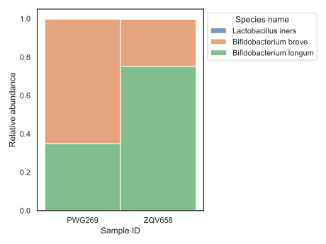

# Metagenomic workflow with Snakemake

In the provided directory, you will find paired Illumina reads for two different samples: `PWG269` & `ZQV658` - `*_1.fastq.gz` denote the forward reads and `*_2.fastq.gz` denote the reverse reads.

The task:

* Map the sample reads onto the three genomes provided in the subdirectory `genomes/`

* Provide an estimated relative abundance of the genomes in the two samples

* Relative abundance = no. of reads mapping to a genome / total reads in metagenome

* Provide a output TSV file called `consolidated_data.tsv` that combines the results for both samples with the following header format:

  ```
  Genome  Relative Abundance      sample_id       species_name
  ```

  * where 'Genome' matches the values in the list `genomes` or the keys of the dictionary `names` as decribed in `mapping-workflow.smk`
  * 'sample_id' consists of either `PWG269` & `ZQV658`
  * 'species_name' consists of the values in the dictionary `names` as decribed in `mapping-workflow.smk`

## Results

To run the script:
```bash
snakemake --snakefile mapping-workflow.smk
```

This is the workflow created with Snakemake:


Mapping results:

| **Genome**                  | **Relative Abundance** | **sample_id** | **species_name**       |
| --------------------------- | ---------------------- | ------------- | ---------------------- |
| **AEKH01.1_genomic**        | 0.001661396554378590   | PWG269        | Lactobacillus iners    |
| **CAAKNZ01.1_genomic**      | 0.6488379529293530     | PWG269        | Bifidobacterium breve  |
| **GCF_902381625.1_genomic** | 0.349500650516268      | PWG269        | Bifidobacterium longum |
| **AEKH01.1_genomic**        | 0.00240733861268147    | ZQV658        | Lactobacillus iners    |
| **CAAKNZ01.1_genomic**      | 0.24584830640326300    | ZQV658        | Bifidobacterium breve  |
| **GCF_902381625.1_genomic** | 0.7517443549840550     | ZQV658        | Bifidobacterium longum |


